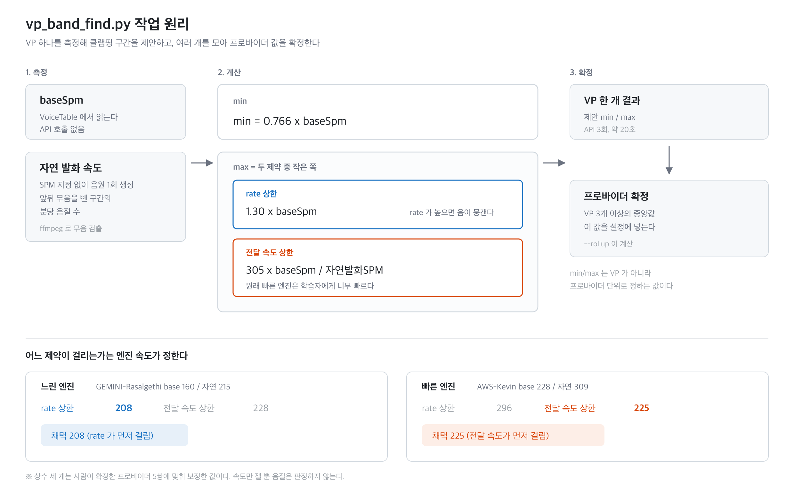

# VP 클램핑 구간 산출 (vp_band_find.py)

Voice Profile 의 min/max SPM 을 계산하는 도구다. VP 하나를 20초 안에 측정하고,
여러 개를 모아 프로바이더 값 한 쌍을 낸다.



## 준비

추가로 설치할 파이썬 패키지는 없다. 표준 라이브러리만 쓴다.

| 필요한 것 | 확인 |
|---|---|
| 파이썬 3.9 이상 | `python3 --version` |
| ffmpeg, ffprobe | `ffmpeg -version` (macOS 는 `brew install ffmpeg`) |
| TTS 인증 토큰 | 환경변수 `TTS_V2_AUTH_TOKEN`, 또는 레포 루트 `.env.local` 에 같은 이름으로 |

## 실행

min/max 는 VP 가 아니라 프로바이더 단위로 정하는 값이라 두 단계로 쓴다.

### 1단계. 그 프로바이더의 VP 를 3개 이상 돌린다

```bash
python3 scripts/vp_band_find.py AZ-Ana-Default
python3 scripts/vp_band_find.py AZ-Hollie-Default
python3 scripts/vp_band_find.py AZ-Nancy-Default
```

`voice-table.ts` 에 아직 없는 새 VP 는 baseSpm 을 직접 넘긴다.

```bash
python3 scripts/vp_band_find.py AZ-NewVoice-Default --base 155
```

### 2단계. 모아서 프로바이더 값을 낸다

```bash
python3 scripts/vp_band_find.py --rollup AZ
```

```
[AZ] VP 5개
  AZ-Ana-Default          base  149.3  자연  250.3  min  114  max  182
  AZ-Hollie-Default       base  157.2  자연  288.8  min  120  max  166
  AZ-Maisie-Default       base  155.8  자연  281.3  min  119  max  169
  AZ-Nancy-Default        base  148.0  자연  308.8  min  113  max  146
  AZ-Tony-Default         base  168.9  자연  306.1  min  129  max  168

  중앙값   min 119   max 168
  VP 편차  min 113~129   max 146~182
```

중앙값이 설정에 넣을 값이다.

### 옵션

| 옵션 | 하는 일 |
|---|---|
| `--base SPM` | baseSpm 을 직접 지정한다 |
| `--no-verify` | 제안값으로 음원을 만들어 확인하는 단계를 건너뛴다. 20초가 1초로 줄어든다 |
| `--out DIR` | 결과 디렉터리를 바꾼다. 기본은 `docs/spm-sweep/vp-band` |

## 계산 논리

측정하는 값은 두 개다.

| 값 | 얻는 방법 |
|---|---|
| `baseSpm` | `src/lib/voice-table.ts` 에서 읽는다. API 호출 없음 |
| 자연 발화 속도 | SPM 을 지정하지 않고 음원을 한 번 만든 뒤, ffmpeg 로 앞뒤 무음을 잘라낸 구간의 분당 음절 수 |

이 둘로 계산한다.

```
min = 0.766 x baseSpm

max = min( 1.30 x baseSpm ,  305 x baseSpm / 자연발화SPM )
```

`min` 은 rate 축에서 정해진다. 엔진이 늘어지기 시작하는 지점이 rate 에 따라 결정되기 때문이다.

`max` 는 두 제약 중 먼저 걸리는 쪽이다. rate 가 너무 높으면 음이 뭉개지고,
rate 가 낮아도 원래 빠른 엔진이면 학습자에게 너무 빠르다. 느린 엔진은 앞쪽이,
빠른 엔진은 뒤쪽이 걸린다. 결과 JSON 의 `maxBoundBy` 가 어느 쪽인지 알려준다.

상수 세 개는 이미 확정된 프로바이더 5쌍의 min/max 에 맞춰 정한 값이다.

## 재는 것과 안 재는 것

음원에서 뽑는 정보는 **속도 하나뿐**이다. 음질은 판정하지 않는다.
기계음이 나거나 목소리가 이상한 경우는 이 도구가 잡아내지 못한다.

계산값은 청취할 구간을 좁혀 주는 용도다. 확정 전에 `audio/` 에 저장된 음원을 들어본다.

## 결과 파일

| 경로 | 내용 |
|---|---|
| `docs/spm-sweep/vp-band/<VP>.json` | VP 한 개 결과. 측정값, 제안 min/max, 검증 기록 |
| `docs/spm-sweep/vp-band/_provider-<프로바이더>.json` | 롤업 결과 |
| `docs/spm-sweep/vp-band/summary.csv` | 돌릴 때마다 한 줄씩 쌓인다 |
| `docs/spm-sweep/vp-band/audio/<VP>/*.mp3` | 판정에 쓴 음원 |

## 주의할 점

**VP 하나로 확정하지 않는다.** 3개 이상 돌리고 롤업한다. VP 가 3개 미만이면 스크립트가 경고한다.
같은 프로바이더 안에서도 VP 별 편차가 크다. 위 AZ 예시에서 max 가 146 부터 182 까지 벌어진다.

**"요청과 전달 속도가 어긋납니다" 경고가 뜨면** 둘 중 하나다. 이미 클램핑이 걸린 프로바이더라
서버가 요청을 잘랐거나, 그 VP 의 baseSpm 이 실제와 다르다. 새 프로바이더를 조사하는 중이라면
후자를 의심한다.

**측정 문장을 바꾸지 않는다.** 스크립트 안의 `SWEEP_TEXT` 와 음절 수 23 이 짝이라
바꾸면 기존 결과와 비교가 안 된다.

**확정 min/max 를 바꾸면 상수도 다시 맞춰야 한다.** 스크립트 상단의 `MIN_SLOPE`,
`MAX_RATE_CAP`, `MAX_DELIVERED_SPM` 세 개다. 데이터 점이 10개뿐이라 상수를 늘리면
바로 과적합된다. 재보정에 쓰는 실측 데이터는 `docs/spm-sweep/results.json` 에 있고,
VP 별 `baselineSpeechSpm` 이 자연 발화 속도다.
